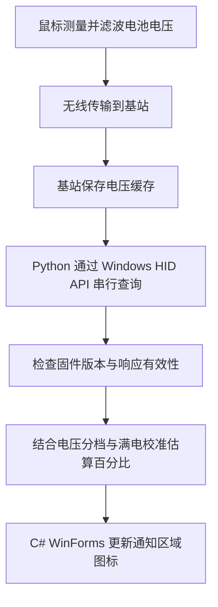

# U2-dw电量显示工具

> 公开副本说明：本文中的“本机”指原开发环境。公开仓库不含官方更新器、提取固件、抓包及原始操作日志；标注“仅本地保留”的证据不随仓库发布。校准与快照为脱敏历史样例，详见 [公开范围](docs/PUBLICATION.md)。

在 Windows 任务栏通知区域显示 **ZOWIE U2-DW 鼠标的估算电量**，适用于通过卓威增强型接收器／充电基站无线连接的使用方式。

**当前已基本可用，可以作为本机这只鼠标的日常电量参考。** 程序能显示数字、定时刷新，并在已验证的断连场景下显示 `--`、重连后恢复。当前通过脚本启动，尚未打包为独立 EXE。

> 电量以“约 N%”表示：程序读取基站缓存的电压，再根据固件电量分档和本机鼠标的满电参考进行估算。它不是设备直接上报的百分比，完整放电过程中的误差尚未测定。

仓库：[0Mercy/U2-dw-battery-monitor](https://github.com/0Mercy/U2-dw-battery-monitor)。

## 功能与完成情况

| 功能 | 当前情况 |
|---|---|
| 通知区域数字图标 | 显示完整估算数字；不可用时显示 `--` |
| 悬浮卡片、右键菜单 | 大号显示“约 N%”，查看缓存电压和查询时间 |
| 自动刷新 | 每轮查询完成后约 30 秒再读取 |
| 手动刷新 | 右键“立即刷新”，或双击图标 |
| 单实例运行 | 重复启动不会创建第二个托盘实例 |
| 鼠标关开、基站拔插恢复 | 已通过实机验收 |
| 正常退出 | 已通过实机验收，图标随程序退出消失 |
| 真实睡眠唤醒 | 暂未实机验收 |
| 独立 EXE、开机启动 | 尚未提供 |

2026-10-05 验收中，**30 项 Python 测试和 13 项 C# 组件测试通过**，并完成显示、菜单刷新、退出、鼠标关开和基站拔插的实机验证。组件测试使用模拟读取器，与实机证据分别记录；长时间连续运行和干净环境部署尚未验收。详见 [验收报告](docs/ACCEPTANCE-2026-10-05.md)。

2026-10-08 界面更新：修正数字换行裁切，增加简洁悬浮卡片及菜单样式。新版编译通过；上述验收结果属于此前版本，本轮未重新运行测试。

## 兼容范围

目前只验证了以下组合：

| 项目 | 已验证值 |
|---|---|
| 系统 | 本机 Windows 环境 |
| 鼠标及连接 | ZOWIE U2-DW，通过增强型接收器／基站无线连接 |
| USB VID:PID | `04A5:800A` |
| 接收器固件版本 | `8511` |
| 鼠标固件版本 | `2526` |
| 百分比校准 | 本机这只鼠标的满电参考 |

其他型号、连接方式和固件版本未验证；更换鼠标或电池后也应重新校准。仓库内的校准文件不能当作所有 U2-DW 的通用电量曲线。

## 快速开始

**首次下载请注意：附带的 4.14 V 校准来自开发者的一只鼠标。程序会使用这份参考曲线，它没有校准你自己的鼠标；请将结果仅作为粗略参考。**

### 1. 准备环境

- Windows PowerShell，以及可用的 .NET Framework WinForms。
- 已安装 Python，且 `python.exe` 可通过 PATH 找到；也可以启动时指定解释器路径。
- 基站已连接电脑，鼠标已开机并连接基站。
- 保持项目目录结构完整，尤其是 `tray/`、`diagnostics/` 及校准相关文件。

日常运行使用 Python 标准库和 Windows HID API，不需要额外 Python 界面库，也不需要 USBPcap、固件分析工具或管理员权限。官方固件更新器和提取资源仅用于此前的协议调查，启动程序不需要运行更新器。

### 2. 启动托盘

双击项目根目录的 **[Start-U2DW.vbs](Start-U2DW.vbs)**。

图标可能位于任务栏右下角的“^”折叠菜单，可手动拖到常驻区域。启动器在后台运行 PowerShell，加载 C# 托盘代码；本项目没有安装服务或注册开机启动。

也可以在项目根目录打开 PowerShell，执行：

```powershell
powershell.exe -NoProfile -STA -ExecutionPolicy Bypass -File .\tray\start.ps1
```

若 PATH 中没有可用的 Python，可显式指定。下面是解释器路径示例，其他机器请替换为实际解释器路径：

```powershell
powershell.exe -NoProfile -STA -ExecutionPolicy Bypass -File .\tray\start.ps1 -PythonPath 'C:\Python\python.exe'
```

这里的 `ExecutionPolicy Bypass` 仅作用于本次启动的 PowerShell 进程，不修改系统的持久执行策略。

### 3. 查看与操作

- **数字图标**：表示估算百分比；悬浮提示和菜单保留“约”的说明。
- **悬浮卡片**：停留约半秒，查看完整估算电量、基站电压和查询时间；“采样时间未提供”表示不知道这份电压何时由鼠标测得。
- **右键菜单**：查看详情、立即刷新或退出。
- **双击图标**：触发一次刷新；正在查询时不会叠加新的查询。
- **`--`**：本轮无法提供有效估算，例如鼠标断连、基站缺失、固件不兼容、读取失败或校准不可用。

鼠标关机或基站拔出后，程序需要在后续查询中识别变化，因此图标不会保证立即改变。设备恢复后会自动重试，也可手动刷新。

## 工作原理

### 从鼠标到托盘的数据链路



程序的协议依据来自对用户提供的官方固件更新器及提取固件的分析，再通过实机查询和人工操作验证。调查过程中没有刷写固件。

### 1. 通过 HID 读取基站缓存

基站提供厂商自定义 HID 接口。程序只使用已确认的三个只读查询命令：

| 命令前缀 | 用途 |
|---|---|
| `08 B4 40` | 接收器固件版本 |
| `08 B4 25` | 基站缓存的鼠标固件版本 |
| `08 B4 15` | 基站缓存的鼠标电池电压 |

请求补齐为 16 字节。一次完整读取按“接收器版本 → 鼠标版本 → 电压 → 再次读取鼠标版本”的顺序执行，检查响应是否完整、固件是否受支持，以及前后鼠标版本是否一致。鼠标版本为零时不展示有效电量。

响应没有命令回显，因此查询必须串行。项目通过 Windows 命名互斥锁协调同一会话内的托盘、诊断查询和厂商报告监听；外部软件和旧版脚本不受此锁约束。

电压原始值按 `0.01 V` 换算，例如 `404` 对应约 `4.04 V`。详细字节格式、推导和兼容边界见 [协议说明](diagnostics/PROTOCOL.md)。

### 2. 用电压估算百分比

目前没有找到可用的设备原生百分比字段，`device_percentage` 仍为空。固件分析提供了电量灯分档对应的电压阈值；本机实测又提供了满电参考点。程序在这些点之间分段线性插值：

| 电压参考点 | 对应百分比 | 依据 |
|---|---:|---|
| 3.400 V | 0% | 估算下限，并非实测耗尽点 |
| 3.679 V | 10% | 固件电量分档阈值 |
| 3.731 V | 25% | 固件电量分档阈值 |
| 3.801 V | 50% | 固件电量分档阈值 |
| 4.140 V | 100% | 这只鼠标经人工确认充满、取下后的参考电压 |

插值结果限制在 0–100%，再取最接近的 5% 档显示。例如，按当前校准，`4.04 V` 会显示为 **约 85%**。这只是计算示例，不是当前实时电量。

**5% 的显示步长不代表误差只有 ±5%。** 电压与剩余容量并非严格线性关系，还受充电、负载、温度和电池老化影响。满电参考来自一次校准，尚未完成完整放电曲线验证。

完整算法、阈值证据和校准过程见 [百分比方法](diagnostics/BATTERY_PERCENTAGE.md)。

### 3. 更新界面并处理异常

C# 托盘程序启动 Python 子进程读取一次结果，随后更新数字、菜单和提示。查询在后台进行；超时会终止本次读取并显示未知状态，之后继续重试。退出时会停止计时器、清理读取子进程并移除图标。

## 怎样理解这个电量数字

- **查询时间不是电压采样时间。** 基站返回缓存，缓存年龄未知；增加刷新频率也不能保证得到新采样。
- **鼠标版本非零不保证电压新鲜。** 它是有效性检查的一部分，不能证明鼠标此刻刚上报了电压。
- **不能确认当前是否在充电或已经充满。** 即使显示“约 100%”，也不表示设备报告了充满状态。
- **适合观察大致电量和变化趋势。** 暂不能据此推算准确剩余续航，也没有经过完整放电验证的误差范围。

## 常见问题

| 现象 | 建议检查 |
|---|---|
| 双击后看不到图标 | 先查看通知区域“^”；仍没有时，用 PowerShell 命令启动查看报错 |
| 提示找不到 Python | 确认可执行 `python --version`，或使用 `-PythonPath` 指定解释器 |
| 显示 `--` | 检查基站连接、鼠标开关、固件兼容性和菜单状态；恢复连接后刷新 |
| 提示设备被占用 | 结束独立诊断查询、报告监听或可能同时访问设备的软件后重试 |
| 电量数字长时间不变 | 电压可能仍是缓存，且百分比按 5% 显示；不能仅凭数字不变判断程序卡住 |
| 校准读取失败 | 检查目录和校准证据是否完整；托盘需要有效校准才能显示百分比 |

运行状态保存在 `%LOCALAPPDATA%\U2DWTray\status.json`，它只保存最近一次状态，并非连续历史日志。启动错误写入同目录的 `startup-error.txt`；旧错误文件可能在后续成功启动后仍然保留。更多排障说明见 [托盘使用说明](docs/TRAY.md)。

## 诊断读取

以下命令从项目根目录执行。实时诊断前先退出托盘，并结束其他 HID 查询或厂商报告监听程序。

```powershell
$env:PYTHONIOENCODING = 'utf-8'

# 离线解释已有原始快照，不访问鼠标
python diagnostics/battery_percentage.py --snapshot diagnostics/percentage-investigation-snapshot.json --calibration diagnostics/full-battery-calibration.json

# 实时读取一次，并应用本机校准
python diagnostics/battery_percentage.py --live --calibration diagnostics/full-battery-calibration.json
```

不带 `--out` 时只输出结果，不改写历史证据。需要保存时，指定新的 `--out` 文件路径。`--snapshot` 接受包含 `receiver`、`mouse_before`、`voltage`、`mouse_after` 的原始查询快照，不能直接传入已转换的百分比结果。

诊断脚本不提供校准时只能解释固件电量分档；托盘则要求有效校准，缺失时显示 `--`。

## 项目结构与文档

| 入口／目录 | 用途 |
|---|---|
| [Start-U2DW.vbs](Start-U2DW.vbs) | 隐藏窗口启动入口 |
| [tray/](tray/) | PowerShell 启动器、C# 托盘界面、Python 读取入口 |
| [diagnostics/](diagnostics/) | HID 查询、电量估算、校准和历史调查证据 |
| [tests/](tests/README.md) | 自动化测试及实机验收工具说明 |
| [docs/](docs/PROJECT.md) | 项目状态、使用说明和验证记录 |

| 文档 | 内容 |
|---|---|
| [托盘使用说明](docs/TRAY.md) | 启动、菜单、刷新、状态文件及排障 |
| [项目状态与计划](docs/PROJECT.md) | 架构、里程碑、决策、后续范围 |
| [验证与已知问题](docs/VALIDATION.md) | 证据、未验证事项、后续验收要求 |
| [2026-10-05 验收报告](docs/ACCEPTANCE-2026-10-05.md) | 本轮自动化与实机验收结果 |
| [协议说明](diagnostics/PROTOCOL.md) | HID 请求、响应、固件与缓存行为 |
| [百分比方法](diagnostics/BATTERY_PERCENTAGE.md) | 阈值、校准、估算算法及误差边界 |
| [诊断说明](diagnostics/README.md) | 工具分类、早期 HID 与抓包调查 |
| [协作规范](AGENTS.md) | 硬件操作边界、证据保留及文档更新规则 |

后续重点是补做真实睡眠唤醒、长时间运行及完整放电校准，再完善独立 EXE 打包和新环境部署。

## 项目来源

项目灵感来自 [rapoo-tray](https://github.com/Iris-0109/rapoo-tray)。它提供了鼠标电量托盘工具的参考思路；本项目针对卓威设备单独调查了 HID 协议并建立估算方式，其厂商命令不能直接照搬。

本地原始记录可能包含设备路径、输入动作和人工确认。对外分享时应制作脱敏副本；官方更新器及提取资源属于本地分析材料，不默认作为项目发布物。
